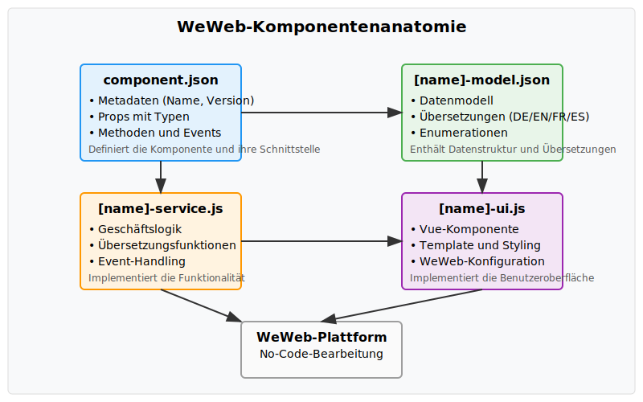

# WeWeb-Integration Dokumentation für die Hochzeitsapp

Diese Dokumentation beschreibt die Integration der Hochzeitsapp in WeWeb, um eine No-Code-Alternative zu ermöglichen. Sie enthält detaillierte Informationen zur Komponentenanatomie, den konvertierten Komponenten und deren Verwendung in WeWeb.

## 1. Überblick über die WeWeb-Komponentenanatomie

### 1.1 Grundstruktur einer WeWeb-Komponente

Jede WeWeb-Komponente besteht aus vier Hauptdateien, die zusammen die vollständige Funktionalität und Konfigurierbarkeit der Komponente in der WeWeb-Umgebung ermöglichen:

1. **component.json** - Definiert die Komponente mit ihren Props, Methoden und Events
   - Enthält Metadaten wie Name und Beschreibung
   - Definiert alle verfügbaren Props mit Typen und Standardwerten
   - Beschreibt Methoden und Events für die Interaktion

2. **[name]-model.json** - Enthält das Datenmodell für die Komponente
   - Definiert die Struktur der Daten, mit denen die Komponente arbeitet
   - Enthält Übersetzungen für mehrsprachige Unterstützung
   - Definiert Enumerationen und Validierungsregeln

3. **[name]-service.js** - Implementiert die Geschäftslogik der Komponente
   - Verarbeitet Daten und Benutzerinteraktionen
   - Implementiert Methoden für die Komponente
   - Stellt Hilfsfunktionen wie Übersetzung und Theming bereit
   - Verwaltet den Zustand und die Events der Komponente

4. **[name]-ui.js** - Implementiert die Benutzeroberfläche als Vue-Komponente
   - Enthält das Template für die Darstellung
   - Implementiert die Reaktivität mit Vue.js
   - Enthält WeWeb-spezifische Konfiguration für die Bearbeitung
   - Definiert das Styling und die Darstellung der Komponente

Diese Struktur ermöglicht eine klare Trennung von Daten, Logik und Darstellung und macht die Komponenten in WeWeb anpassbar und wiederverwendbar.



*Abbildung 1: Struktur und Zusammenspiel der vier Hauptdateien einer WeWeb-Komponente*

### 1.2 WeWeb-spezifische Konfiguration

Jede Komponente enthält spezielle Konfigurationsobjekte, die die Integration in die WeWeb-Umgebung ermöglichen:

- **weweb** - Definiert den Typ und das UI-Schema der Komponente
- **wwElement** - Konfiguriert die Komponente für die WeWeb-Oberfläche
- **wwConfig** - Definiert Labels, Icons und Standardwerte für die Bearbeitung

Diese Konfiguration ermöglicht es, dass die Komponenten in der WeWeb-Oberfläche angezeigt, konfiguriert und verwendet werden können, ohne dass Programmierkenntnisse erforderlich sind.

### 1.3 Implementierung in der Hochzeitsapp

In der Hochzeitsapp wurden React-Komponenten zu Vue-Komponenten konvertiert und mit der WeWeb-Komponentenanatomie kompatibel gemacht. Dies ermöglicht es, die App in WeWeb zu bearbeiten und anzupassen, ohne Programmierkenntnisse zu benötigen.

Die Komponenten wurden so strukturiert, dass sie:
- Vollständig in WeWeb konfigurierbar sind
- Mehrsprachigkeit unterstützen (DE/EN/FR/ES)
- Einen Dark Mode implementieren
- Mobile-optimiert sind
- Mit der Supabase-Datenbank verbunden werden können

## 2. Detaillierte Beschreibung der konvertierten Komponenten

### 2.1 WeWebIntegration

Die WeWebIntegration-Komponente dient als Brücke zwischen der Hochzeitsapp und WeWeb. Sie ermöglicht die Verbindung, Synchronisierung und Konfiguration der Integration.

#### 2.1.1 Funktionen

- Verbindung mit WeWeb herstellen
- WeWeb-Dokumentation anzeigen
- Synchronisierung mit WeWeb durchführen
- Statusanzeige der Verbindung
- Entwicklermodus für erweiterte Funktionen

#### 2.1.2 Dateien und Struktur

- **component.json**
  - Definiert Props wie `isDeveloperMode`, `connectionStatus`, `lastSync`, `theme` und `language`
  - Definiert Methoden wie `connectToWeWeb`, `viewDocumentation` und `syncWithWeWeb`
  - Definiert Events wie `onConnect` und `onSync`

- **weweb-integration-model.json**
  - Enthält das Datenmodell mit `connection` und `settings`
  - Enthält Übersetzungen für Deutsch und Englisch
  - Definiert Enumerationen für Status, Theme und Sprache

- **weweb-integration-service.js**
  - Implementiert die Verbindungslogik mit WeWeb
  - Stellt Übersetzungsfunktionen bereit
  - Verwaltet Theme und Sprache
  - Implementiert Event-Handling

- **weweb-integration-ui.js**
  - Implementiert die Benutzeroberfläche mit Vue.js
  - Zeigt Verbindungsstatus und Aktionen an
  - Enthält reaktive Komponenten für Theme und Sprache
  - Enthält WeWeb-Konfiguration für die Bearbeitung

#### 2.1.3 Konfigurationsoptionen

- **isDeveloperMode** (Boolean): Aktiviert erweiterte Funktionen für Entwickler
- **theme** (String): Wählt zwischen "light" und "dark" Theme
- **language** (String): Wählt zwischen "de" und "en" Sprache

### 2.2 ImageWithSEO

Die ImageWithSEO-Komponente ist eine erweiterte Bildkomponente, die SEO-Optimierungen enthält und responsive Darstellung unterstützt.

#### 2.2.1 Funktionen

- Bildanzeige mit SEO-Attributen
- Responsive Bildanpassung
- Lazy Loading für bessere Performance
- Alt-Text-Validierung für SEO

#### 2.2.2 Dateien und Struktur

- **component.json**
  - Definiert Props wie `src`, `alt`, `width`, `height`, `loading`, `className`, `theme` und `language`
  - Enthält Standardwerte und Validierungen

- **image-with-seo-model.json**
  - Enthält das Datenmodell mit `image` und `settings`
  - Enthält Übersetzungen für Fehlermeldungen
  - Definiert Enumerationen für Loading-Verhalten

- **image-with-seo-service.js**
  - Implementiert Bildvalidierung und -optimierung
  - Stellt Übersetzungsfunktionen bereit
  - Verwaltet Theme und Sprache

- **image-with-seo-ui.js**
  - Implementiert die Bilddarstellung mit SEO-Attributen
  - Zeigt Fehlermeldungen bei fehlenden Attributen
  - Enthält reaktive Komponenten für Theme und Sprache
  - Enthält WeWeb-Konfiguration für die Bearbeitung

#### 2.2.3 Konfigurationsoptionen

- **src** (String): URL des Bildes
- **alt** (String): Alternativer Text für das Bild (wichtig für SEO)
- **width** (Number): Breite des Bildes in Pixeln
- **height** (Number): Höhe des Bildes in Pixeln
- **loading** (String): Ladeverhalten des Bildes ("lazy" oder "eager")
- **className** (String): CSS-Klassen für das Bild
- **theme** (String): Wählt zwischen "light" und "dark" Theme
- **language** (String): Wählt zwischen "de" und "en" Sprache

### 2.3 SEO

Die SEO-Komponente ermöglicht die Optimierung der Seite für Suchmaschinen und soziale Medien.

#### 2.3.1 Funktionen

- Meta-Tag-Generierung für Suchmaschinen
- Open Graph-Tags für soziale Medien
- Twitter Card-Tags für Twitter
- Vorschau für Google, Facebook und Twitter

#### 2.3.2 Dateien und Struktur

- **component.json**
  - Definiert Props wie `title`, `description`, `keywords`, `canonicalUrl`, `ogImage`, `ogType`, `twitterCard`, `theme` und `language`
  - Enthält Standardwerte und Validierungen

- **seo-model.json**
  - Enthält das Datenmodell mit SEO-Einstellungen
  - Enthält Übersetzungen für die Benutzeroberfläche
  - Definiert Enumerationen für OG-Typen und Twitter Cards

- **seo-service.js**
  - Implementiert die Generierung von Meta-Tags
  - Stellt Vorschaufunktionen bereit
  - Verwaltet Theme und Sprache

- **seo-ui.js**
  - Implementiert die Benutzeroberfläche mit Vorschau
  - Zeigt Vorschau für Google, Facebook und Twitter
  - Enthält reaktive Komponenten für Theme und Sprache
  - Enthält WeWeb-Konfiguration für die Bearbeitung

#### 2.3.3 Konfigurationsoptionen

- **title** (String): Seitentitel
- **description** (String): Seitenbeschreibung
- **keywords** (String): Schlüsselwörter für Suchmaschinen
- **canonicalUrl** (String): Kanonische URL der Seite
- **ogImage** (String): Bild für Open Graph (soziale Medien)
- **ogType** (String): Open Graph Typ ("website", "article", "product")
- **twitterCard** (String): Twitter Card Typ ("summary", "summary_large_image", "app", "player")
- **theme** (String): Wählt zwischen "light" und "dark" Theme
- **language** (String): Wählt zwischen "de" und "en" Sprache

### 2.4 Trauzeugen-Bereich / Best-Man-Section

Die Trauzeugen-Bereich-Komponente (auch als Best-Man-Section bezeichnet) bietet einen geschützten Bereich für Trauzeugen und andere Mitglieder des Hochzeitsteams.

#### 2.4.1 Funktionen

- JGA-Planungstool
- Abstimmungsfunktion
- Kostenaufteilungssystem
- Aufgabenverwaltung
- Notizen und Ereignisse

#### 2.4.2 Dateien und Struktur

- **best-man-section-model.json**
  - Enthält das Datenmodell mit `bestManUser`, `task`, `note` und `event`
  - Definiert Rollen wie "bestMan", "maidOfHonor", "groomsman", "bridesmaid"
  - Enthält Standardrollen und Beschreibungen

- **best-man-section-service.js**
  - Implementiert die Geschäftslogik für den Trauzeugen-Bereich
  - Verwaltet Benutzer, Aufgaben, Notizen und Ereignisse
  - Implementiert Authentifizierung und Autorisierung

- **best-man-section-ui.js** / **trauzeugen-bereich-ui.js**
  - Implementiert die Benutzeroberfläche für den Trauzeugen-Bereich
  - Zeigt Aufgaben, Notizen und Ereignisse an
  - Enthält Formulare für die Erstellung und Bearbeitung
  - Enthält WeWeb-Konfiguration für die Bearbeitung

#### 2.4.3 Konfigurationsoptionen

- **accessCode** (String): Zugangscode für den geschützten Bereich
- **showJgaPlanning** (Boolean): Zeigt JGA-Planungstool an
- **showCostSplitting** (Boolean): Zeigt Kostenaufteilungssystem an
- **showVoting** (Boolean): Zeigt Abstimmungsfunktion an
- **theme** (String): Wählt zwischen "light" und "dark" Theme
- **language** (String): Wählt zwischen "de" und "en" Sprache

## 3. Anleitung zur Verwendung der Komponenten in WeWeb

### 3.1 Komponenten importieren

Um die Hochzeitsapp-Komponenten in WeWeb zu importieren, folgen Sie diesen Schritten:

1. Öffnen Sie Ihr WeWeb-Projekt
2. Navigieren Sie zu "Components" > "Import Component"
3. Wählen Sie den Ordner der zu importierenden Komponente aus (z.B. "weweb-integration")
4. Klicken Sie auf "Import"

Die Komponente wird nun in Ihrer Komponentenliste angezeigt und kann verwendet werden.

### 3.2 Komponenten verwenden

Um die importierten Komponenten zu verwenden, folgen Sie diesen Schritten:

1. Ziehen Sie die importierte Komponente aus der Komponentenliste auf Ihre Seite
2. Konfigurieren Sie die Komponente über das Eigenschaftenpanel auf der rechten Seite
3. Verbinden Sie die Komponente mit Datenquellen oder anderen Komponenten über das Datenpanel

### 3.3 Komponenten konfigurieren

Jede Komponente bietet spezifische Konfigurationsoptionen:

#### 3.3.1 WeWebIntegration

- **Entwicklermodus**: Aktivieren Sie diese Option, um erweiterte Funktionen anzuzeigen
- **Theme**: Wählen Sie zwischen Hell- und Dunkel-Modus
- **Sprache**: Wählen Sie zwischen Deutsch und Englisch

#### 3.3.2 ImageWithSEO

- **Bildquelle**: Geben Sie die URL des Bildes ein
- **Alt-Text**: Geben Sie einen beschreibenden Text für das Bild ein (wichtig für SEO)
- **Abmessungen**: Konfigurieren Sie Breite und Höhe des Bildes
- **Ladeverhalten**: Wählen Sie zwischen "lazy" und "eager" Loading
- **CSS-Klassen**: Fügen Sie benutzerdefinierte CSS-Klassen hinzu

#### 3.3.3 SEO

- **Seitentitel**: Geben Sie den Titel der Seite ein
- **Beschreibung**: Geben Sie eine kurze Beschreibung der Seite ein
- **Schlüsselwörter**: Geben Sie relevante Schlüsselwörter ein
- **Kanonische URL**: Geben Sie die kanonische URL der Seite ein
- **Open Graph**: Konfigurieren Sie Bild und Typ für soziale Medien
- **Twitter Card**: Wählen Sie den Twitter Card-Typ

#### 3.3.4 Trauzeugen-Bereich

- **Zugangscode**: Legen Sie einen Zugangscode für den geschützten Bereich fest
- **Funktionen**: Aktivieren oder deaktivieren Sie JGA-Planung, Kostenaufteilung und Abstimmung
- **Berechtigungen**: Konfigurieren Sie, welche Rollen welche Funktionen nutzen können

### 3.4 Komponenten verbinden

Die Komponenten können miteinander und mit Datenquellen verbunden werden:

1. Wählen Sie die Komponente aus, die Sie verbinden möchten
2. Öffnen Sie das Datenpanel auf der rechten Seite
3. Wählen Sie die Datenquelle oder Komponente aus, mit der Sie verbinden möchten
4. Wählen Sie die Eigenschaften aus, die verbunden werden sollen

Beispiel: Verbinden der SEO-Komponente mit dynamischen Daten:
- Verbinden Sie den "title" mit dem Seitentitel aus Ihrer Datenbank
- Verbinden Sie die "description" mit der Seitenbeschreibung aus Ihrer Datenbank
- Verbinden Sie das "ogImage" mit einem Bild aus Ihrer Medienbibliothek

## 4. Implementierte Funktionen

### 4.1 Mehrsprachigkeit (DE/EN/FR/ES)

Alle Komponenten unterstützen Mehrsprachigkeit mit Deutsch und Englisch als Hauptsprachen und Französisch und Spanisch als zusätzliche Sprachen.


*Abbildung 2: Implementierung der Mehrsprachigkeit in WeWeb-Komponenten*

#### 4.1.1 Implementierung

- **Sprachauswahl**: Über die `language`-Prop kann die Sprache der Komponente gewählt werden
- **Übersetzungsdateien**: In den model.json-Dateien sind Übersetzungen für alle unterstützten Sprachen enthalten
- **Übersetzungsfunktion**: Die Service-Klassen stellen eine `translate()`-Funktion bereit, die Texte in die gewählte Sprache übersetzt
- **Reaktive Aktualisierung**: Bei Änderung der Sprache wird die UI automatisch aktualisiert

#### 4.1.2 Beispiel für Übersetzungsdaten

```json
"translations": {
  "de": {
    "title": "WeWeb Integration",
    "description": "Verbinden Sie Ihre LemonVows App mit WeWeb für No-Code-Bearbeitung",
    "connectButton": "Mit WeWeb verbinden"
  },
  "en": {
    "title": "WeWeb Integration",
    "description": "Connect your LemonVows app to WeWeb for no-code editing",
    "connectButton": "Connect to WeWeb"
  },
  "fr": {
    "title": "Intégration WeWeb",
    "description": "Connectez votre application LemonVows à WeWeb pour une édition sans code",
    "connectButton": "Connecter à WeWeb"
  },
  "es": {
    "title": "Integración WeWeb",
    "description": "Conecte su aplicación LemonVows a WeWeb para edición sin código",
    "connectButton": "Conectar a WeWeb"
  }
}
```

#### 4.1.3 Verwendung in WeWeb

Um die Sprache einer Komponente zu ändern:
1. Wählen Sie die Komponente aus
2. Ändern Sie die "Sprache"-Eigenschaft im Eigenschaftenpanel
3. Die Komponente wird sofort in der gewählten Sprache angezeigt

Um die Sprache dynamisch zu ändern:
1. Erstellen Sie eine Variable für die Sprache (z.B. "currentLanguage")
2. Verbinden Sie die "language"-Eigenschaft der Komponente mit dieser Variable
3. Ändern Sie die Variable, um die Sprache aller verbundenen Komponenten zu ändern

### 4.2 Dark Mode

Alle Komponenten unterstützen einen verbesserten Dark Mode mit anpassbaren Farbschemata.


*Abbildung 3: Implementierung des Dark Mode in WeWeb-Komponenten*

#### 4.2.1 Implementierung

- **Theme-Auswahl**: Über die `theme`-Prop kann zwischen "light" und "dark" gewählt werden
- **Dynamische CSS-Klassen**: Basierend auf dem aktuellen Theme werden CSS-Klassen dynamisch angewendet
- **Reaktive Aktualisierung**: Bei Änderung des Themes wird die UI automatisch aktualisiert
- **Konsistente Farbpalette**: Für beide Themes wurde eine konsistente Farbpalette definiert

#### 4.2.2 Beispiel für Theme-Klassen

```javascript
const themeClasses = computed(() => {
  return {
    container: props.theme === 'dark' ? 'bg-gray-800 text-white' : 'bg-white text-gray-800',
    panel: props.theme === 'dark' ? 'bg-gray-700 border-gray-600' : 'bg-gray-50 border-gray-200',
    button: {
      primary: props.theme === 'dark' ? 'bg-blue-600 hover:bg-blue-700 text-white' : 'bg-blue-500 hover:bg-blue-600 text-white',
      secondary: props.theme === 'dark' ? 'bg-gray-600 hover:bg-gray-700 text-white' : 'bg-gray-200 hover:bg-gray-300 text-gray-800'
    }
  };
});
```

#### 4.2.3 Verwendung in WeWeb

Um das Theme einer Komponente zu ändern:
1. Wählen Sie die Komponente aus
2. Ändern Sie die "Theme"-Eigenschaft im Eigenschaftenpanel
3. Die Komponente wird sofort im gewählten Theme angezeigt

Um das Theme dynamisch zu ändern:
1. Erstellen Sie eine Variable für das Theme (z.B. "currentTheme")
2. Verbinden Sie die "theme"-Eigenschaft der Komponente mit dieser Variable
3. Ändern Sie die Variable, um das Theme aller verbundenen Komponenten zu ändern

## 5. Best Practices für die mobile Optimierung

Die Komponenten wurden mit einem Mobile-First-Ansatz entwickelt und bieten verschiedene Funktionen für die mobile Optimierung.


*Abbildung 4: Mobile-Optimierung in WeWeb-Komponenten*

### 5.1 Responsive Layouts

- **Flexbox und Grid**: Alle Komponenten verwenden Flexbox und CSS Grid für responsive Layouts
- **Viewport-Anpassung**: Die Komponenten passen sich automatisch an verschiedene Bildschirmgrößen an
- **Breakpoints**: Es werden Standard-Breakpoints für verschiedene Gerätetypen verwendet

Beispiel für responsive Implementierung:
```css
.weweb-panel {
  width: 100%;
  padding: 1rem;
}

@media (min-width: 640px) {
  .weweb-panel {
    width: 80%;
    padding: 1.5rem;
  }
}

@media (min-width: 1024px) {
  .weweb-panel {
    width: 60%;
    padding: 2rem;
  }
}
```

### 5.2 Touch-freundliche Bedienelemente

- **Größere Klickbereiche**: Buttons und interaktive Elemente haben ausreichend große Klickbereiche
- **Ausreichende Abstände**: Zwischen interaktiven Elementen gibt es ausreichend Abstand, um Fehleingaben zu vermeiden
- **Feedback bei Berührung**: Visuelle Rückmeldung bei Berührung von interaktiven Elementen

Beispiel für touch-freundliche Buttons:
```css
.touch-button {
  min-height: 44px;
  min-width: 44px;
  padding: 12px 16px;
  margin: 8px;
  border-radius: 4px;
}
```

### 5.3 Optimierte Ladezeiten

- **Lazy Loading**: Bilder werden standardmäßig mit Lazy Loading geladen
- **Optimierte Ressourcen**: CSS und JavaScript werden minimiert und gebündelt
- **Responsive Bilder**: Bilder werden in verschiedenen Größen bereitgestellt und je nach Gerät geladen

Beispiel für Lazy Loading von Bildern:
```html

```

### 5.4 Mobile-First Design

- **Priorität für mobile Inhalte**: Die wichtigsten Inhalte werden zuerst angezeigt
- **Vereinfachte Navigation**: Auf mobilen Geräten wird eine vereinfachte Navigation angeboten
- **Angepasste Typografie**: Schriftgrößen und -abstände sind für mobile Geräte optimiert

### 5.5 Tipps für die mobile Optimierung in WeWeb

1. **Testen auf verschiedenen Geräten**: Verwenden Sie die responsive Vorschau in WeWeb, um Ihre Seite auf verschiedenen Geräten zu testen
2. **Breakpoints anpassen**: Passen Sie die Breakpoints in WeWeb an Ihre Zielgeräte an
3. **Bilder optimieren**: Verwenden Sie die ImageWithSEO-Komponente mit angepassten Größen für verschiedene Geräte
4. **Vereinfachen Sie die Navigation**: Erstellen Sie eine mobile Navigation mit einem Hamburger-Menü
5. **Reduzieren Sie den Inhalt**: Zeigen Sie auf mobilen Geräten nur die wichtigsten Inhalte an

## 6. Tipps zur Erweiterung der Komponenten

### 6.1 Bestehende Komponenten anpassen

Um bestehende Komponenten anzupassen, können Sie folgende Schritte befolgen:

1. **Kopieren Sie die Komponentendateien**: Erstellen Sie Kopien der bestehenden Komponenten
2. **Ändern Sie die Metadaten**: Aktualisieren Sie Namen und Beschreibungen in den JSON-Dateien
3. **Erweitern Sie das Datenmodell**: Fügen Sie neue Eigenschaften zum Datenmodell hinzu
4. **Erweitern Sie die Service-Klasse**: Implementieren Sie neue Methoden und Funktionen
5. **Aktualisieren Sie die UI**: Passen Sie das Template und die Styles an

Beispiel für die Erweiterung einer Komponente:
```javascript
// Originale Komponente
export default {
  name: 'ImageWithSEO',
  props: {
    src: String,
    alt: String
  }
};

// Erweiterte Komponente
export default {
  name: 'EnhancedImageWithSEO',
  props: {
    src: String,
    alt: String,
    caption: String,
    gallery: Boolean
  }
};
```

### 6.2 Neue WeWeb-kompatible Komponenten erstellen

Um neue Komponenten zu erstellen, die mit WeWeb kompatibel sind, befolgen Sie diese Schritte:

1. **Erstellen Sie die Grundstruktur**: Erstellen Sie die vier Hauptdateien (component.json, model.json, service.js, ui.js)
2. **Definieren Sie das Datenmodell**: Erstellen Sie ein Datenmodell mit allen benötigten Eigenschaften
3. **Implementieren Sie die Service-Klasse**: Implementieren Sie die Geschäftslogik der Komponente
4. **Erstellen Sie die UI**: Implementieren Sie die Benutzeroberfläche mit Vue.js
5. **Fügen Sie WeWeb-Konfiguration hinzu**: Fügen Sie die WeWeb-spezifische Konfiguration hinzu

Beispiel für eine neue Komponente:
```javascript
// component.json
{
  "name": "NewComponent",
  "description": "Eine neue Komponente für WeWeb",
  "version": "1.0.0",
  "props": {
    "title": {
      "type": "string",
      "description": "Titel der Komponente",
      "default": "Neuer Titel"
    }
  }
}

// new-component-model.json
{
  "name": "NewComponentModel",
  "description": "Datenmodell für die neue Komponente",
  "version": "1.0.0",
  "dataModel": {
    "content": {
      "title": "string",
      "description": "string"
    }
  }
}

// new-component-service.js
class NewComponentService {
  constructor() {
    // Implementierung
  }
}

// new-component-ui.js
export default {
  name: 'NewComponentUI',
  props: {
    title: String
  },
  template: `
    <div class="new-component">
      <h2>{{ title }}</h2>
    </div>
  `
};
```

### 6.3 Integration mit Supabase

Die Komponenten können mit Supabase integriert werden, um Daten zu speichern und abzurufen:

1. **Supabase-Client initialisieren**: Initialisieren Sie den Supabase-Client mit den Zugangsdaten
2. **Daten abrufen**: Verwenden Sie die Supabase-API, um Daten abzurufen
3. **Daten speichern**: Verwenden Sie die Supabase-API, um Daten zu speichern
4. **Echtzeit-Updates**: Nutzen Sie die Echtzeit-Funktionen von Supabase für Live-Updates

Beispiel für die Integration mit Supabase:
```javascript
import { createClient } from '@supabase/supabase-js';

const supabaseUrl = 'https://cwuygosoynoitfrikdts.supabase.co';
const supabaseKey = 'XWeTCWRb5wQ6NMDMPW43h6YL+PLRpg78rDxfZMpMrZQothSTvYP+/BjG8hR6ZpO4EWae9fhsjOstZ1srzEH1PA==';
const supabase = createClient(supabaseUrl, supabaseKey);

// Daten abrufen
async function fetchData() {
  const { data, error } = await supabase
    .from('table_name')
    .select('*');
  
  if (error) {
    console.error('Error fetching data:', error);
    return null;
  }
  
  return data;
}

// Daten speichern
async function saveData(item) {
  const { data, error } = await supabase
    .from('table_name')
    .insert([item]);
  
  if (error) {
    console.error('Error saving data:', error);
    return false;
  }
  
  return true;
}
```

### 6.4 Best Practices für die Komponentenentwicklung

1. **Trennung von Daten und Darstellung**: Halten Sie Datenmodell und UI strikt getrennt
2. **Wiederverwendbarkeit**: Gestalten Sie Komponenten so, dass sie in verschiedenen Kontexten wiederverwendet werden können
3. **Dokumentation**: Dokumentieren Sie Ihre Komponenten ausführlich, damit andere sie verstehen und verwenden können
4. **Validierung**: Implementieren Sie Validierung für alle Eingaben und Props
5. **Fehlerbehandlung**: Implementieren Sie robuste Fehlerbehandlung und Fallbacks
6. **Barrierefreiheit**: Achten Sie auf Barrierefreiheit (ARIA-Attribute, Tastaturnavigation)
7. **Performance**: Optimieren Sie die Performance durch effiziente Ressourcennutzung

## 7. Zusammenfassung

Die WeWeb-Integration der Hochzeitsapp ermöglicht es, die App in WeWeb zu bearbeiten und anzupassen, ohne Programmierkenntnisse zu benötigen. Die konvertierten Komponenten (WeWebIntegration, ImageWithSEO, SEO, Trauzeugen-Bereich) bieten umfangreiche Funktionen und sind vollständig in WeWeb konfigurierbar.

Die Komponenten unterstützen Mehrsprachigkeit (DE/EN/FR/ES), einen Dark Mode und sind für mobile Geräte optimiert. Sie können einfach in WeWeb importiert, verwendet und angepasst werden.

Mit den bereitgestellten Tipps können Sie die Komponenten erweitern und neue WeWeb-kompatible Komponenten erstellen, um die Funktionalität der Hochzeitsapp weiter auszubauen.
